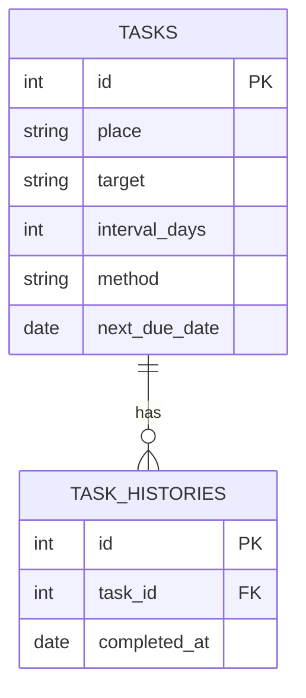

# 掃除通知アプリ (Cleaning Notification App)

「ついうっかり掃除を忘れてしまう」を解決するための、自分専用の掃除管理・通知アプリです。
場所ごとの詳細な掃除手順（マニュアル）を管理し、適切なタイミングで LINE 通知を行います。

## 技術スタック
- Frontend: React, TypeScript, Vite
- Backend: Java, Spring Boot, Spring Data JPA
- Database: PostgreSQL
- Infrastructure: Docker
- Notification: LINE Messaging API

## 設計
### データベース設計 (ER図)

### API エンドポイント
| メソッド | エンドポイント | 説明 |
| :--- | :--- | :--- |
| GET | `/api/tasks` | 掃除タスク一覧を取得 |
| POST | `/api/tasks` | 新しい掃除タスクを追加 |
| PUT | `/api/tasks/{taskId}` | 掃除タスクを編集 |
| DELETE | `/api/tasks/{taskId}` | 掃除タスクを削除 |
| POST | `/api/tasks/{taskId}/complete` | 掃除完了の記録と次回予定日の更新 |
